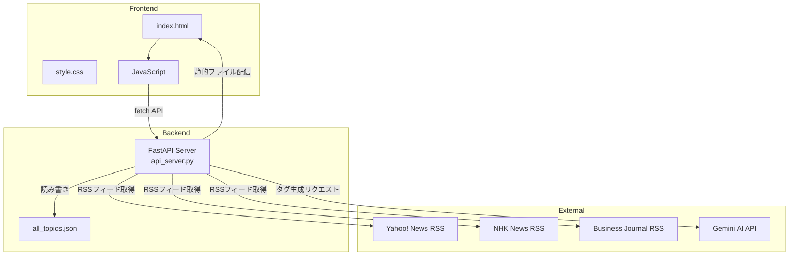
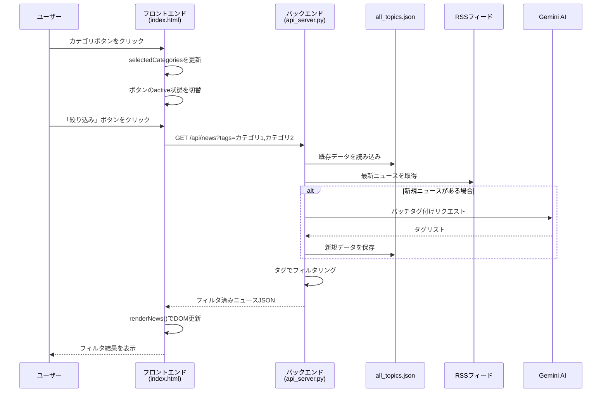

# NCC-AI-NEWS

AIを活用したニュースアグリゲーションアプリケーション。複数のニュースソースからRSSフィードを取得し、Gemini AIによる自動タグ付け機能とカテゴリフィルタリング機能を提供します。

## 目次

- [アーキテクチャ概要](#アーキテクチャ概要)
- [カテゴリ変更から画面表示までのロジック](#カテゴリ変更から画面表示までのロジック)
- [起動手順・インストール作業](#起動手順インストール作業)
- [API仕様](#api仕様)

---

## アーキテクチャ概要



### ファイル構成

| ファイル | 説明 |
|---------|------|
| `api_server.py` | FastAPIバックエンドサーバー。ニュース取得、AIタグ付け、フィルタリングAPIを提供 |
| `index.html` | フロントエンドUI。カテゴリフィルターとニュース一覧を表示 |
| `style.css` | UIスタイルシート |
| `gen_news_topics.py` | スタンドアロンのニュース取得・タグ付けスクリプト（開発・テスト用） |
| `all_topics.json` | ニュースデータの永続化ファイル（キャッシュ） |
| `.env` | 環境変数設定（Gemini APIキー） |

---

## カテゴリ変更から画面表示までのロジック

ユーザーがカテゴリを選択してから画面が更新されるまでの処理フローを、フロントエンド・バックエンド両面から詳細に説明します。

### 処理フロー全体図



---

### フロントエンド処理詳細

#### 1. カテゴリ選択（UIのみ更新）

```javascript
// index.html内のtoggleCategory関数
function toggleCategory(category, button) {
    if (selectedCategories.has(category)) {
        selectedCategories.delete(category);
        button.classList.remove('active');
    } else {
        selectedCategories.add(category);
        button.classList.add('active');
    }
    updateApplyButtonState();
}
```

- カテゴリボタンをクリックすると、`selectedCategories` (Set) に追加/削除
- ボタンに `active` クラスを付与してハイライト表示
- **この時点ではAPI呼び出しは発生しない**（パフォーマンス最適化）

#### 2. 絞り込み実行（API呼び出し）

```javascript
// 「絞り込み」ボタンクリック時
document.getElementById('apply-filter').addEventListener('click', () => {
    filterNews();
});

function filterNews() {
    if (selectedCategories.size === 0) {
        loadNews();  // 全件取得
    } else {
        loadNews(selectedCategories);  // タグフィルタ付きで取得
    }
}
```

#### 3. API通信とニュース取得

```javascript
async function loadNews(filterTags = null) {
    let url = `${API_BASE}/api/news`;
    if (filterTags && filterTags.size > 0) {
        url += `?tags=${Array.from(filterTags).join(',')}`;
    }
    
    const response = await fetch(url);
    const data = await response.json();
    
    allNewsData = data.news;
    renderNews(allNewsData);
}
```

- 選択されたカテゴリをカンマ区切りでクエリパラメータに設定
- 例: `GET /api/news?tags=政治,経済`

#### 4. 画面描画

```javascript
function renderNews(data) {
    const container = document.getElementById('news-container');
    container.innerHTML = '';

    data.forEach(item => {
        const card = document.createElement('div');
        card.className = 'news-card';
        
        // タイトル（リンク付き）
        const title = document.createElement('a');
        title.href = item.link;
        title.textContent = item.title;
        card.appendChild(title);
        
        // 説明文
        if (item.description) {
            const description = document.createElement('p');
            description.textContent = item.description;
            card.appendChild(description);
        }
        
        // タグ表示（選択中のカテゴリはハイライト）
        item.tags.forEach(tag => {
            const tagElement = document.createElement('span');
            tagElement.className = 'tag';
            if (selectedCategories.has(tag)) {
                tagElement.classList.add('highlighted');
            }
            tagElement.textContent = tag;
            container.appendChild(tagElement);
        });
        
        container.appendChild(card);
    });
}
```

---

### バックエンド処理詳細

#### 1. `/api/news` エンドポイント

```python
@app.get("/api/news")
async def get_news(tags: str = Query(None)):
    # 既存データ読み込み
    existing_topics = load_existing_topics()
    existing_tags = get_all_existing_tags(existing_topics)
    
    # RSSから最新ニュース取得
    all_fetched = []
    for rss_url in NEWS_LINKS:
        topics = get_topics_from_rss(rss_url)[:4]  # 各サイト4件まで
        all_fetched.extend(topics)
    
    # 新規ニュースを検出（リンクで重複チェック）
    new_topics = find_new_topics(all_fetched, existing_topics)
```

#### 2. 差分タグ付け（新規ニュースのみAI処理）

```python
    if new_topics:
        # 新規ニュースにタグ付け（既存タグで正規化）
        new_tags = tag_topics_batch_with_normalization(new_topics, existing_tags)
        
        for i, topic in enumerate(new_topics):
            topic['tags'] = new_tags[i]
        
        # 既存データと結合（新規を先頭に）
        all_topics = new_topics + existing_topics
        save_topics(all_topics)
```

> [!TIP]
> **パフォーマンス最適化**: 既に取得済みのニュースにはAIタグ付けを行わず、新規ニュースのみ処理することでAPI呼び出しを最小限に抑えています。

#### 3. タグによるフィルタリング

```python
    # タグでフィルタリング
    if tags:
        filter_tags = set(tags.split(','))
        all_topics = [
            topic for topic in all_topics
            if topic.get('tags') and any(tag in filter_tags for tag in topic['tags'])
        ]
    
    return {
        "count": len(all_topics),
        "news": all_topics,
        "new_count": len(new_topics) if new_topics else 0
    }
```

- クエリパラメータ `tags` をカンマで分割
- **OR条件**: ニュースのタグのいずれかが選択タグに含まれていれば一致

---

### AIタグ付けロジック

#### バッチ処理によるタグ生成

```python
def tag_topics_batch_with_normalization(topics: list, existing_tags: list) -> list:
    # ニュース一覧を番号付きで作成
    news_list = []
    for i, topic in enumerate(topics):
        content = topic['title'] + ' ' + (topic['description'] or '')
        news_list.append(f"{i+1}. {content}")
    
    news_text = "\n".join(news_list)
```

#### タグ正規化プロンプト

```python
    system_prompt = f"""
        # 命令
        入力される複数のニュース記事それぞれに関連するタグを生成し、JSON形式で出力する。
        
        # 制約条件
        - **重要**: 以下の既存タグと同義のタグは、既存タグの表記に統一すること
          例: 「ベースボール」→「野球」、「テック」→「テクノロジー」
        
        # 既存タグリスト
        {existing_tags_str}
        
        # 出力形式
        [
            ["政治", "外交"],
            ["経済", "株式"],
            ["スポーツ", "野球"]
        ]
    """
```

> [!IMPORTANT]
> **タグ正規化**: 既存のタグリストをプロンプトに含めることで、「野球」と「ベースボール」のような表記ゆれを防止し、一貫性のあるタグ付けを実現しています。

---

## 起動手順・インストール作業

### 前提条件

- **Python 3.11以上**
- **uv** (Pythonパッケージマネージャー) または pip
- **Gemini API キー** ([Google AI Studio](https://aistudio.google.com/app/apikey) で取得)

### 1. リポジトリのクローン

```bash
git clone <repository-url>
cd NCC-AI-NEWS
```

### 2. 環境変数の設定

`.env` ファイルを作成し、Gemini APIキーを設定します。

```bash
# .envファイルを作成
echo GEMINI_TOKEN=your_api_key_here > .env
```

または、手動で `.env` ファイルを作成:

```env
GEMINI_TOKEN=your_gemini_api_key
```

> [!CAUTION]
> `.env` ファイルには機密情報が含まれるため、**絶対にGitにコミットしないでください**。`.gitignore` に追加されていることを確認してください。

### 3. 依存関係のインストール

#### uvを使用する場合（推奨）

```bash
# uvがインストールされていない場合
pip install uv

# 依存関係をインストール
uv sync
```

#### pipを使用する場合

```bash
# 仮想環境を作成・有効化
python -m venv .venv
.venv\Scripts\activate  # Windows
# source .venv/bin/activate  # macOS/Linux

# 依存関係をインストール
pip install fastapi uvicorn google-genai python-dotenv requests
```

### 4. サーバーの起動

#### uvを使用する場合

```bash
uv run python api_server.py
```

#### 直接実行する場合

```bash
python api_server.py
```

### 5. アプリケーションへのアクセス

ブラウザで以下のURLにアクセス:

```
http://localhost:8000
```

---

## API仕様

### GET `/api/news`

ニュース一覧を取得します。

| パラメータ | 型 | 説明 |
|-----------|-----|------|
| `tags` | string (optional) | カンマ区切りのタグでフィルタリング |

**レスポンス例:**

```json
{
    "count": 10,
    "news": [
        {
            "title": "ニュースタイトル",
            "link": "https://example.com/news/1",
            "description": "ニュースの説明文",
            "pub_date": "2025-12-12T10:00:00+09:00",
            "tags": ["政治", "経済"]
        }
    ],
    "new_count": 2
}
```

### GET `/api/tags`

利用可能なタグ一覧を取得します（出現回数順）。

**レスポンス例:**

```json
{
    "tags": [
        {"name": "政治", "count": 5},
        {"name": "経済", "count": 4},
        {"name": "スポーツ", "count": 2}
    ]
}
```

---

## 依存パッケージ

| パッケージ | バージョン | 用途 |
|-----------|-----------|------|
| fastapi | >=0.124.2 | WebフレームワークおよびAPIサーバー |
| uvicorn | >=0.38.0 | ASGIサーバー |
| google-genai | >=1.55.0 | Gemini AI API クライアント |
| python-dotenv | >=0.9.9 | 環境変数読み込み |
| requests | (標準) | HTTPリクエスト（RSS取得） |

---

## ニュースソース

以下のRSSフィードからニュースを取得しています：

- [Yahoo! ニュース トップピックス](https://news.yahoo.co.jp/rss/topics/top-picks.xml)
- [NHK ニュース](https://www.nhk.or.jp/rss/news/cat0.xml)
- [Business Journal](https://biz-journal.jp/index.xml)
